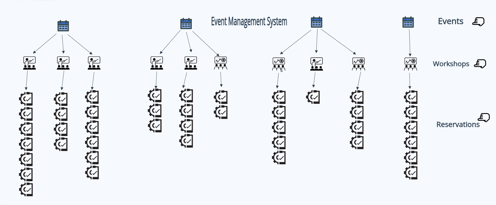
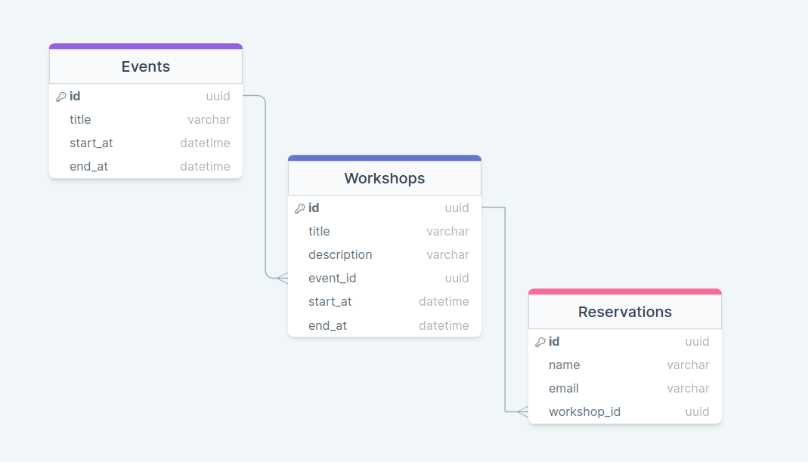

# Event Management System


A basic Event Management System backend build with go pramming language. Is has a very few usecases and 3 modules. 

1. Events module.
2. Workshops module.
3. Reservations module.


## Usecase_



1. There can have multiple events. 
2. A event can have multiple workshops. 
3. A workshop can have multiple reservations. 


## Database Schema_




## EndPoints_

## Get all events


Request
-----
**Method**: GET

***URL***:

```sh
{domain}/api/v1/events/list?perPage={PerPageIndicentCount}&currentPage={CurrentPageNumber}
```


Response
--------
**Status Code**: 200

<details>
<summary>Response</summary>

```sh
{
    "events": [
        {
            "id": 1,
            "title": "Sample Event 1",
            "start_at": "2023-11-10T12:00:00Z",
            "end_at": "2023-11-10T15:00:00Z"
        },
        {
            "id": 2,
            "title": "Sample Event 2",
            "start_at": "2023-11-12T09:00:00Z",
            "end_at": "2023-11-12T11:30:00Z"
        },
        {
            "id": 3,
            "title": "Sample Event 3",
            "start_at": "2023-11-15T14:00:00Z",
            "end_at": "2023-11-15T17:00:00Z"
        },
        {
            "id": 4,
            "title": "Sample Event 4",
            "start_at": "2023-11-20T08:00:00Z",
            "end_at": "2023-11-20T10:30:00Z"
        },
        {
            "id": 5,
            "title": "Sample Event 5",
            "start_at": "2023-11-25T13:00:00Z",
            "end_at": "2023-11-25T15:45:00Z"
        },
        {
            "id": 6,
            "title": "Sample Event 6",
            "start_at": "2023-11-27T11:00:00Z",
            "end_at": "2023-11-27T14:00:00Z"
        },
        {
            "id": 7,
            "title": "Sample Event 7",
            "start_at": "2023-12-01T09:30:00Z",
            "end_at": "2023-12-01T11:00:00Z"
        },
        {
            "id": 8,
            "title": "Sample Event 8",
            "start_at": "2023-12-05T10:00:00Z",
            "end_at": "2023-12-05T12:30:00Z"
        },
        {
            "id": 9,
            "title": "Sample Event 9",
            "start_at": "2023-12-10T15:00:00Z",
            "end_at": "2023-12-10T17:30:00Z"
        },
        {
            "id": 10,
            "title": "Sample Event 10",
            "start_at": "2023-12-15T13:45:00Z",
            "end_at": "2023-12-15T16:00:00Z"
        }
    ],
    "pagination": {
        "total": 20,
        "per_page": 10,
        "total_page": 2,
        "current_page": 1
    }
}
```
</details>


## Get Event Details

Request
-----

**URL**:

```sh
{domain}/api/v1/events/details?eventId={EventID}
```


Response
--------
**Status Code**: 200

<details>
<summary>Response</summary>

```sh
{
    "id": 1,
    "title": "Sample Event 1",
    "start_at": "2023-11-10T12:00:00Z",
    "end_at": "2023-11-10T15:00:00Z",
    "total_workshops": 7
}
```
</details>


## Get Workshop List by Event

Request
-----

**URL**:

```sh
{domain}/api/v1/workshops/list?eventId={EventID}
```


Response
--------
**Status Code**: 200

<details>
<summary>Response</summary>

```sh
{
    "id": 2,
    "title": "Sample Event 2",
    "start_at": "2023-11-12T09:00:00Z",
    "end_at": "2023-11-12T11:30:00Z",
    "workshops": [
        {
            "id": 2,
            "title": "Sample Workshop 2",
            "description": "Description 2",
            "event_id": 2,
            "start_at": "2023-11-12T10:00:00Z",
            "end_at": "2023-11-12T12:00:00Z"
        },
        {
            "id": 5,
            "title": "Sample Workshop 2",
            "description": "Description 2",
            "event_id": 2,
            "start_at": "2023-11-12T10:00:00Z",
            "end_at": "2023-11-12T12:00:00Z"
        },
        {
            "id": 8,
            "title": "Sample Workshop 2",
            "description": "Description 2",
            "event_id": 2,
            "start_at": "2023-11-12T10:00:00Z",
            "end_at": "2023-11-12T12:00:00Z"
        },
        {
            "id": 11,
            "title": "Sample Workshop 2",
            "description": "Description 2",
            "event_id": 2,
            "start_at": "2023-11-12T10:00:00Z",
            "end_at": "2023-11-12T12:00:00Z"
        },
        {
            "id": 14,
            "title": "Sample Workshop 2",
            "description": "Description 2",
            "event_id": 2,
            "start_at": "2023-11-12T10:00:00Z",
            "end_at": "2023-11-12T12:00:00Z"
        },
        {
            "id": 17,
            "title": "Sample Workshop 2",
            "description": "Description 2",
            "event_id": 2,
            "start_at": "2023-11-12T10:00:00Z",
            "end_at": "2023-11-12T12:00:00Z"
        },
        {
            "id": 20,
            "title": "Sample Workshop 2",
            "description": "Description 2",
            "event_id": 2,
            "start_at": "2023-11-12T10:00:00Z",
            "end_at": "2023-11-12T12:00:00Z"
        }
    ]
}
```
</details>


## Get Workshop Details

Request
-----
Method: GET

**URL**:

```sh
{domain}/api/v1/workshops/details?workshopId={WorkshopID}
```

Response
--------
**Status Code**: 200

<details>
<summary>Response</summary>

```sh
{
    "id": 13,
    "title": "Sample Workshop 1",
    "description": "Description 1",
    "start_at": "2023-11-10T13:00:00Z",
    "end_at": "2023-11-10T14:30:00Z",
    "total_reservations": 4
}
```
</details>


## Create Reservation in Workshops

Request
-----

**Method**: POST

**URL**:
```sh
{domain}/api/v1/reservations/
```

<details>
<summary>Request Payload</summary>

```sh
{
    "name": "mahin",
    "email": "mahifffn@gmail.com",
    "workshop_id": 13
}
```
</details>


Response
------

**Status Code**: 201
<details>
<summary>Response</summary>

```sh
{
    "id": 25,
    "name": "mahin",
    "email": "mahifffn@gmail.com",
    "workshop_id": 13
}
```
</details>

